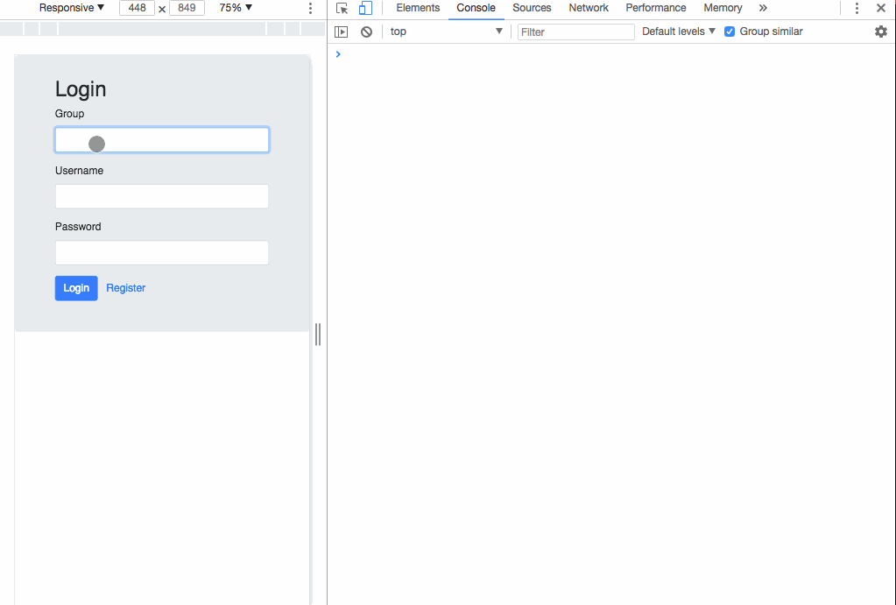

React redux pouchdb couchdb Login SignUp boilerplate

In the project directory,

First you need to install the dependencies

### `npm install`

 then you can run:

### `npm start`

Group: will be the name of a existing CouchDB database.

After running it you should have something like this:

